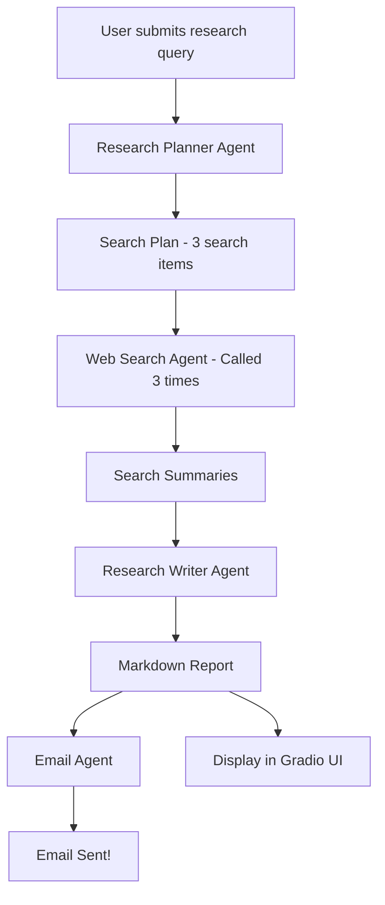

# 🧠Digital-Research-Assistant
---
An end-to-end autonomous research system that takes a user query and delivers a full-length research report—summarized, well-structured, and emailed to your inbox using SendGrid.

✨ Powered by OpenAI GPT-4o Agents + Web Search + Email Delivery + Gradio UI  

⚡ Application link: https://huggingface.co/spaces/FaiazAI/Digital_Research_Assistant

---

## 📌 Features

- 🔍 **AI-powered Web Search Planning** — Breaks down a query into targeted search terms.
  
- 🌐 **Live Web Search** — Uses tools to retrieve the latest info from the internet.
  
- 📝 **Cohesive Report Generation** — Generates high-quality, coherent research content.
  
- 📧 **Email Delivery** — Sends HTML-formatted report via SendGrid.
  
- 🖥️ **Gradio UI** — Simple browser-based interface to run your research.
  
---

## 🧱 System Architecture


## 🗂 Folder Structure

```
.
├── app.py                     # Gradio interface entry point
├── research_manager.py       # Main controller for research execution
├── agents/
│   ├── research_writer.py
│   ├── web_searcher.py
│   ├── research_planner.py
│   ├── email_agent.py
├── requirements.txt
├── .env                      # Local secrets file (replaced with HF secrets for Hugging Face)
└── README.md
```
---

## 🚀 How to Use

### 1. 🧪 Local Setup

```bash
git clone https://github.com/FaiazS/Digital-Research-Assistant.git
cd digital-research-assistant
pip install -r requirements.txt
```

> Setup a `.env` file:

```
OPENAI_API_KEY=your-openai-key
SENDGRID_API_KEY=your-sendgrid-key
```

Then run:

```bash
python app.py
```

The UI will open in your browser!

## 💡 Sample Prompt

> _"AI's contribution in tackling and mitigating the impacts of Climate Change."_

# 🔁 AI-Powered Research Pipeline: End-to-End Flow:

Step 1:  User types a query in the Gradio UI.
        
Step 2:  ResearchManager is called - begins the pipeline.
        
Step 3:  research_planner agent - breaks query into 3 search terms.
        
Step 4:  web_searcher agent - performs web search for each term and summarizes them.
        
Step 5:  research_writer agent - creates structured outline + full report from the summaries.
        
Step 6:  email_agent - formats the report in HTML and emails it.
        
Step 7:  Final markdown report displayed in Gradio UI and emailed!

---

## 🧠 Built With

- GPT-4o Agents (`openai-agents`)
  
- SendGrid Email API
  
- Python `asyncio` + modularization
  
- Gradio UI for interactivity
  
- Hugging Face Spaces for deployment

---

## 📬 Author

**Faiaz Ahmed**  
[LinkedIn](https://www.linkedin.com/in/faiazahmed22/) • [Email](mailto:faiazrex8@gmail.com)
